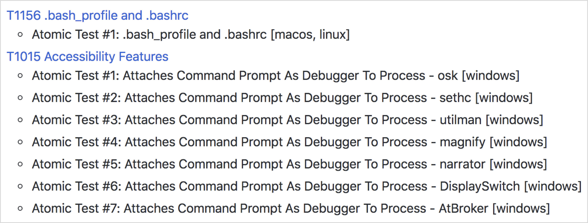

# Using Atomic Red Team to test your security

Our Atomic Red Team tests are small, highly portable detection tests mapped to the MITRE ATT&CK Framework. Each test
is designed to map back to a particular tactic. This gives defenders a highly actionable way to immediately start
testing their defenses against a broad spectrum of attacks.

# A quick history

We initially created Atomic Red Team as a way to test Red Canary’s detection coverage against the best adversary 
tactic/technique taxonomy, Mitre's ATT&CK. Our Detection Engineering team had a well baked unit testing process but
wanted to add "functional testing". Atomic Red Team was born. 

We soon realized that we could help teams use the same approach to evaluate Red Canary and other detection and 
response products to assess their coverage. The standard testing method of using malware samples from VirusTotal or 
other malware sharing sites was an exceptionally poor representation of a real-world adversary. And you simply 
couldn't trust most vendors to give you unbiased samples.

With these principles in mind, we publicly launched Atomic Red Team. The response we received was, honestly, a bit 
overwhelming and showed us that there was a massive need in the community for this type of project. We are 
especially grateful to the MITRE ATT&CK team, whose great work has given us a great taxonomy to work within.

# Key Beliefs

## Teams need to be able to test everything from specific technical controls to outcomes.
Security teams do not want to operate with a "hopes and prayers" attitude toward detection. We need to know 
what our controls and program can detect, and what theyit cannot. We don’t have to detect every adversary, but we do 
need to believe in knowing our blind spots.

## We should be able to run a test in less than five minutes.
Most security tests and automation tools take a tremendous amount of time to install, configure, and execute. We 
coined the term “atomic tests” because we felt there was a simple way to decompose tests so most could be run 
in a few minutes.

**The best test is the one you actually run.**

## We need to keep learning how adversaries are operating.
Most security teams don’t have the benefit of seeing a wide variety of adversary types and techniques crossing 
their networks every day. Even at Red Canary we only come across a fraction of the possible techniques being 
used, which makes the community working together essential to making us all better.

### Ready to start testing? [Get started!](/testing)